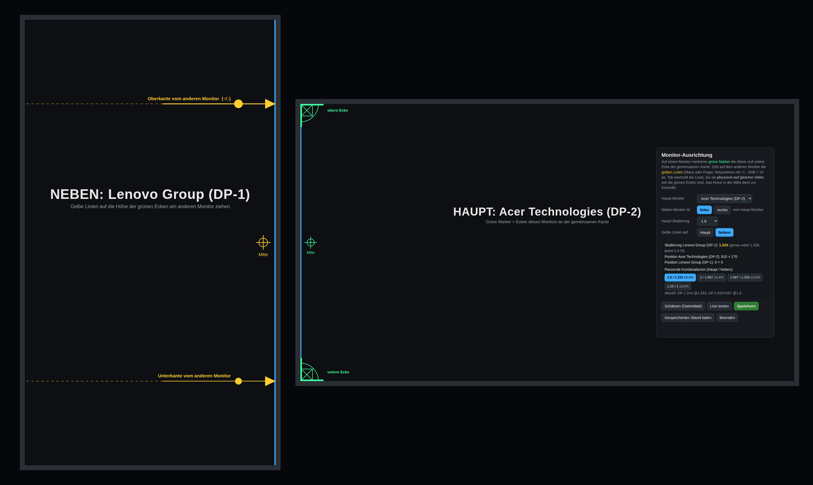
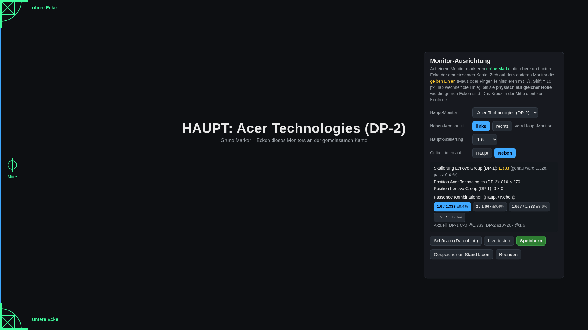

<div align="center">

# 🖥️↔️🖥️ fix-my-scaling-omarchy

**Zwei Monitore so einstellen, wie sie wirklich auf dem Schreibtisch stehen: Seite, Höhe und Skalierung.**
Für [Omarchy](https://omarchy.org) / Hyprland. Die Oberfläche ist Deutsch oder Englisch, je nach Systemsprache.

[](https://omarchy.org)
[](#voraussetzungen)
[](LICENSE)
[](README.md)



</div>

---

## Warum?

Wenn deine Monitore unterschiedlich groß oder unterschiedlich aufgelöst sind oder einer hochkant steht, springt die Maus beim Wechsel zwischen den Bildschirmen.
Fenster sind auf dem einen Bildschirm größer als auf dem anderen, und die Kanten passen nicht zusammen.
`position = "1080x269"` und `scale = 1.33` in der `monitors.lua` so lange zu raten, bis es passt, nervt.

**fix-my-scaling** macht daraus eine Sache von zwei Minuten:

1. 🟩 Ein Monitor zeigt **grüne Marker** in der oberen und unteren Ecke der Kante, an der sich die Bildschirme treffen.
2. 🟨 Auf dem anderen Monitor ziehst du zwei **gelbe Linien**, bis sie *physisch* auf gleicher Höhe mit diesen Ecken sind.
3. 🧮 Das Tool berechnet den **Höhenversatz** und eine **passende Skalierung**, damit beide Bildschirme in echt gleich groß wirken.
4. ⚡ **Live testen** klicken, Maus über die Kante schieben, **Speichern** klicken. Fertig.

## Funktionen

| | |
|---|---|
| 🎯 **Physisch ausrichten** | Echte Ecken über den Rahmen hinweg angleichen, mit Maus, Finger oder Pfeiltasten |
| 📐 **Skalierungs-Vorschläge** | Hyprland nimmt pro Auflösung nur bestimmte „saubere“ Skalierungen an. Das Tool zeigt Paare, die fast genau passen (z. B. `1.6 / 1.333 ±0.4 %`) |
| ↔️ **Links oder rechts** | Du stellst ein, auf welcher Seite der zweite Monitor steht. Vertauschte Monitore sind mit einem Klick korrigiert |
| 🔄 **Gedrehte Bildschirme** | Beim Start fragt jeder Monitor, welche Kante physisch oben ist, und dreht sich passend. Danach rechnet die Ausrichtung mit der richtigen Lage |
| 🧱 **Keine Überlappung** | Schreibt exakte Skalierungen (`4/3` statt `1.33333`) und stellt in sicherer Reihenfolge um. Hyprland meldet dadurch nie *„Monitor überlappt mit anderen Monitoren“*. Nach dem Speichern wird neu geladen und nochmal geprüft |
| 👆 **Touch-Test** | Jeder Tipp erscheint als roter Punkt, praktisch für Touchscreens auf gedrehten Monitoren |
| 💾 **Sicheres Speichern** | Nur die `hl.monitor(...)`-Zeilen der beiden Monitore werden geändert. Vorher wird ein Backup `monitors.lua.bak.<zeit>` angelegt |
| 🌍 **Deutsch / Englisch** | Richtet sich nach der Systemsprache (`LANG`), erzwingen mit `FIX_MY_SCALING_LANG=de` oder `en` |
| 📦 **Keine Abhängigkeiten** | Python-Standardbibliothek + das Chromium, das bei Omarchy dabei ist |

## Installation

```bash
git clone https://github.com/vsvito420/fix-my-scaling-omarchy.git
cd fix-my-scaling-omarchy
./install.sh
```

Danach öffnest du **Monitor-Ausrichtung** über den App-Starter (<kbd>Super</kbd> + <kbd>Space</kbd>) oder im Terminal:

```bash
fix-my-scaling
```

Entfernen: `./uninstall.sh` (deine `monitors.lua` und ihre Backups bleiben erhalten).

## Bedienung



| Einstellung | Bedeutung |
|---|---|
| **Haupt-Monitor** | Der Monitor, dessen Skalierung du selbst wählst, meistens dein großer / Gaming-Bildschirm |
| **Neben-Monitor ist links / rechts** | Wo der andere Monitor wirklich steht |
| **Haupt-Skalierung** | Skalierung des Haupt-Monitors. Die des Neben-Monitors wird daraus berechnet |
| **Gelbe Linien auf** | Die Linien liegen auf dem physisch *höheren* Monitor, weil nur dort beide Ecken des anderen hinpassen. Wird automatisch gewählt |
| **Passende Kombinationen** | Paare aus Haupt- und Neben-Skalierung, bei denen beide Bildschirme (fast) dieselbe echte Pixeldichte haben. Klick übernimmt |
| **Schätzen (Datenblatt)** | Startwerte aus der EDID-Größe der Monitore in Millimetern, vertikal zentriert |
| **Live testen** | Wendet das Ergebnis an, ohne zu speichern. Maus über die Kante schieben und prüfen |
| **Speichern** | Schreibt `~/.config/hypr/monitors.lua` (mit Backup), lädt Hyprland neu und prüft auf Überlappung |
| **Gespeicherten Stand laden** | Verwirft Live-Änderungen und lädt die gespeicherte Config neu |

**Feinjustieren:** Gelbe Linie anklicken, dann <kbd>↑</kbd> / <kbd>↓</kbd> (1 px) oder <kbd>Shift</kbd> + <kbd>↑</kbd> / <kbd>↓</kbd> (10 px). <kbd>Tab</kbd> wechselt zwischen oberer und unterer Linie.

## So funktioniert's

```
 Neben-Monitor (höher)            Haupt-Monitor
┌────────────────────┐
│                    │
│ ─────────────────▶ │ ┌──────────────────────────────┐ ◀ grüne obere Ecke
│  gelbe obere Linie │ │                              │
│                    │ │                              │
│                  ⊕ │ │ ⊕  Mitte (Kontrolle)         │
│                    │ │                              │
│ ─────────────────▶ │ └──────────────────────────────┘ ◀ grüne untere Ecke
│ gelbe untere Linie │
│                    │
└────────────────────┘
```

Der Abstand zwischen den gelben Linien ist die echte Höhe des anderen Monitors, gemessen in Pixeln dieses Monitors.
Daraus ergibt sich die Skalierung, bei der beide Bildschirme gleich dicht sind. Das Tool rastet auf die nächste Skalierung ein,
die Hyprland sauber annimmt (ganze logische Pixel in 1/120-Schritten), und zentriert den Monitor vertikal zwischen den Linien.

Technisch läuft ein kleiner lokaler Webserver (nur `127.0.0.1`, pro Start mit Zufalls-Token geschützt). Er öffnet pro Monitor ein
Chromium-App-Fenster im Vollbild, wendet Änderungen mit `hyprctl eval` an und bearbeitet die `monitors.lua`.

## Voraussetzungen

- Omarchy oder Hyprland mit **Lua-Config** (`~/.config/hypr/monitors.lua`, `hl.monitor({ ... })`)
- Python 3
- Ein Chromium-basierter Browser (`chromium`, bei Omarchy dabei, oder Chrome / Brave / Helium)

## Gut zu wissen

> [!TIP]
> **Den Skalierungs-Regler im Omarchy-Tray nicht zusammen mit Einstellungen pro Monitor benutzen.** Er setzt die Skalierung des fokussierten Monitors mit `position = "auto"` und speichert sie in eine allgemeine Einstellung. Beim nächsten Neuladen springt sie zurück, und die Monitore können verrutschen. Nimm dieses Tool oder ändere `scale =` pro Monitor.

> [!NOTE]
> Gebaut für **zwei** Monitore. Wenn mehr angeschlossen sind, richtet es den Haupt-Monitor mit einem anderen Monitor aus und lässt die übrigen, wo sie sind. Prüf das Layout danach.

> [!NOTE]
> Gedrehter Touchscreen? Hyprland dreht den Touch nicht immer mit dem Bild mit. Binde ihn an den Monitor und setz dieselbe Drehung:
> ```lua
> hl.device({ name = "dein-touch-geraet", output = "DP-1", transform = 1 })
> ```
> (`hyprctl devices` zeigt den Namen unter *Touch*.) Die roten Punkte im Tool zeigen dir sofort, ob die Tipps an der richtigen Stelle landen.

## Lizenz

[MIT](LICENSE) © 2026 vsvito420
