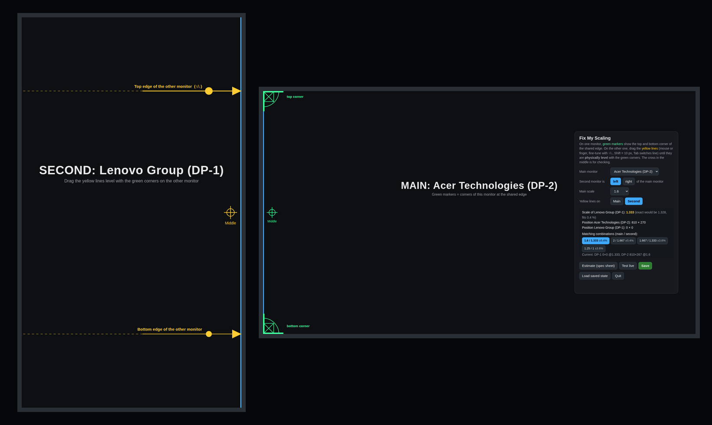
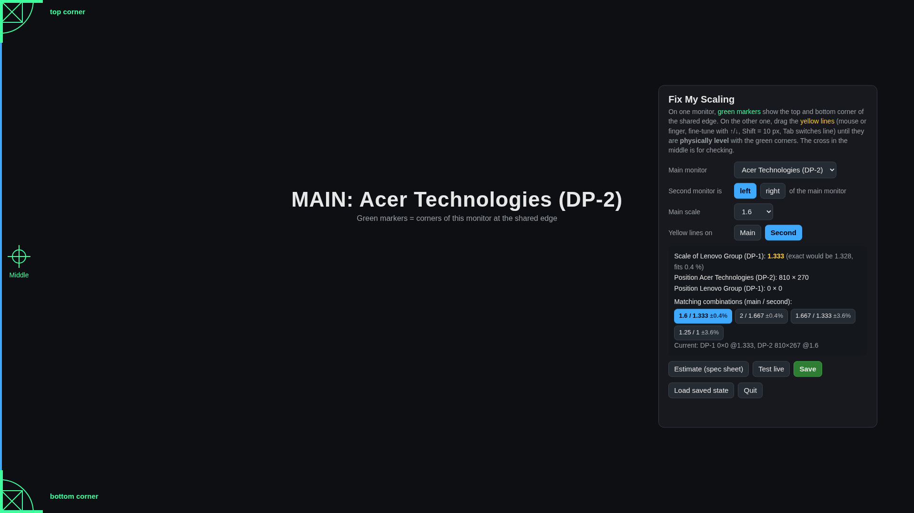

<div align="center">

# 🖥️↔️🖥️ fix-my-scaling-omarchy

**Line up two monitors the way they actually stand on your desk: side, height and scale.**
For [Omarchy](https://omarchy.org) / Hyprland. The UI is German or English, depending on your system language.

[](https://omarchy.org)
[](#requirements)
[](LICENSE)
[](README.de.md)



</div>

---

## Why?

When your monitors differ in size, resolution or orientation, the mouse jumps when it crosses from one to the other.
Windows dragged across look bigger on one screen than on the other, and the edges don't line up.
Guessing `position = "1080x269"` and `scale = 1.33` in `monitors.lua` until it feels right gets old fast.

**fix-my-scaling** turns that into a two-minute visual job:

1. 🟩 One monitor shows **green markers** in the top and bottom corner of the edge the two screens share.
2. 🟨 On the other monitor, you drag two **yellow lines** until they are *physically* level with those corners.
3. 🧮 The tool calculates the **vertical offset** and a **matching scale** so both screens have the same pixel density in real life.
4. ⚡ Click **Test live**, move the mouse across the edge, then click **Save**. Done.

## Features

| | |
|---|---|
| 🎯 **Physical alignment** | Line up real corners across the bezel, with the mouse, a finger or the arrow keys |
| 📐 **Scale suggestions** | Hyprland only accepts certain "clean" scales per resolution. The tool lists pairs that match within fractions of a percent (e.g. `1.6 / 1.333 ±0.4 %`) |
| ↔️ **Left or right** | Tell it which side the second monitor is on. Swapped monitors are fixed with one click |
| 🔄 **Rotated screens** | Works with portrait / rotated monitors. Rotation and mode are kept as they are |
| 🧱 **No overlaps** | Writes exact scales (`4/3` instead of `1.33333`) and applies changes in a safe order, so Hyprland never reports *"monitor overlaps with other monitor(s)"*. After saving it reloads and checks again |
| 👆 **Touch check** | Every tap shows up as a red dot, handy for touchscreens on rotated monitors |
| 💾 **Safe saving** | Only the `hl.monitor(...)` lines of the two monitors change. A backup `monitors.lua.bak.<time>` is made first |
| 🌍 **German / English** | Follows your system language (`LANG`), override with `FIX_MY_SCALING_LANG=de` or `en` |
| 📦 **No dependencies** | Python standard library + the Chromium that ships with Omarchy |

## Install

```bash
git clone https://github.com/vsvito420/fix-my-scaling-omarchy.git
cd fix-my-scaling-omarchy
./install.sh
```

Then open **Fix My Scaling** from the app launcher (<kbd>Super</kbd> + <kbd>Space</kbd>), or run:

```bash
fix-my-scaling
```

To remove it again: `./uninstall.sh` (your `monitors.lua` and its backups stay untouched).

## How to use it



| Setting | What it does |
|---|---|
| **Main monitor** | The monitor whose scale you choose yourself, usually your big / gaming screen |
| **Second monitor is left / right** | Where the other monitor physically stands |
| **Main scale** | Scale of the main monitor. The second monitor's scale is calculated from it |
| **Yellow lines on** | The lines go on the physically *taller* monitor, because only there do both corners of the other one fit. Chosen automatically |
| **Matching combinations** | Main / second scale pairs where both screens end up with (almost) the same real pixel density. Click one to use it |
| **Estimate (spec sheet)** | Starting values from the monitors' EDID size in millimetres, vertically centred |
| **Test live** | Applies the result without saving. Move the mouse across the edge to check |
| **Save** | Writes `~/.config/hypr/monitors.lua` (with backup), reloads Hyprland and checks for overlaps |
| **Load saved state** | Throws away live changes and reloads your saved config |

**Fine-tuning:** click a yellow line, then use <kbd>↑</kbd> / <kbd>↓</kbd> (1 px) or <kbd>Shift</kbd> + <kbd>↑</kbd> / <kbd>↓</kbd> (10 px). <kbd>Tab</kbd> switches between the top and bottom line.

## How it works

```
 second monitor (taller)          main monitor
┌────────────────────┐
│                    │
│ ─────────────────▶ │ ┌──────────────────────────────┐ ◀ green top corner
│   yellow top line  │ │                              │
│                    │ │                              │
│                  ⊕ │ │ ⊕  middle (check)            │
│                    │ │                              │
│ ─────────────────▶ │ └──────────────────────────────┘ ◀ green bottom corner
│ yellow bottom line │
│                    │
└────────────────────┘
```

The distance between the two yellow lines is the real height of the other monitor, measured in pixels of this one.
From that the tool derives the scale that gives both screens the same density. Then it snaps to the nearest scale Hyprland
accepts cleanly (whole logical pixels in 1/120 steps) and centres the monitor vertically between the lines.

Under the hood a tiny local web server (`127.0.0.1` only, protected by a random token per run) serves one fullscreen
Chromium app window per monitor, applies changes with `hyprctl eval` and edits `monitors.lua`.

## Requirements

- Omarchy, or Hyprland with a **Lua config** (`~/.config/hypr/monitors.lua`, `hl.monitor({ ... })`)
- Python 3
- A Chromium-based browser (`chromium`, which comes with Omarchy, or Chrome / Brave / Helium)

## Good to know

> [!TIP]
> **Don't use the scaling slider in the Omarchy tray together with per-monitor lines.** It applies the scale to the focused monitor with `position = "auto"` and saves it to a generic setting. The next config reload snaps it back, and it can move your monitors around. Use this tool, or edit `scale =` per monitor.

> [!NOTE]
> Built for setups with **two** monitors. With more connected, it aligns the main monitor with one other monitor and does not move the rest, so check the layout afterwards.

> [!NOTE]
> Rotated touchscreen? Hyprland doesn't always rotate touch input with the display. Bind it to the monitor and set the same transform:
> ```lua
> hl.device({ name = "your-touch-device", output = "DP-1", transform = 1 })
> ```
> (`hyprctl devices` lists the name under *Touch*.) The red dots in this tool show you right away if taps land in the right place.

## License

[MIT](LICENSE) © 2026 vsvito420
